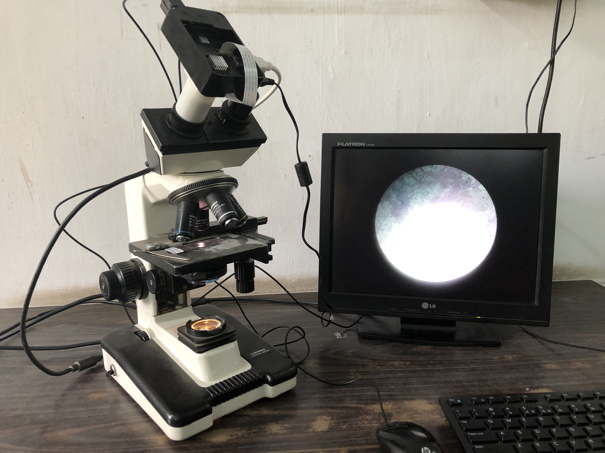
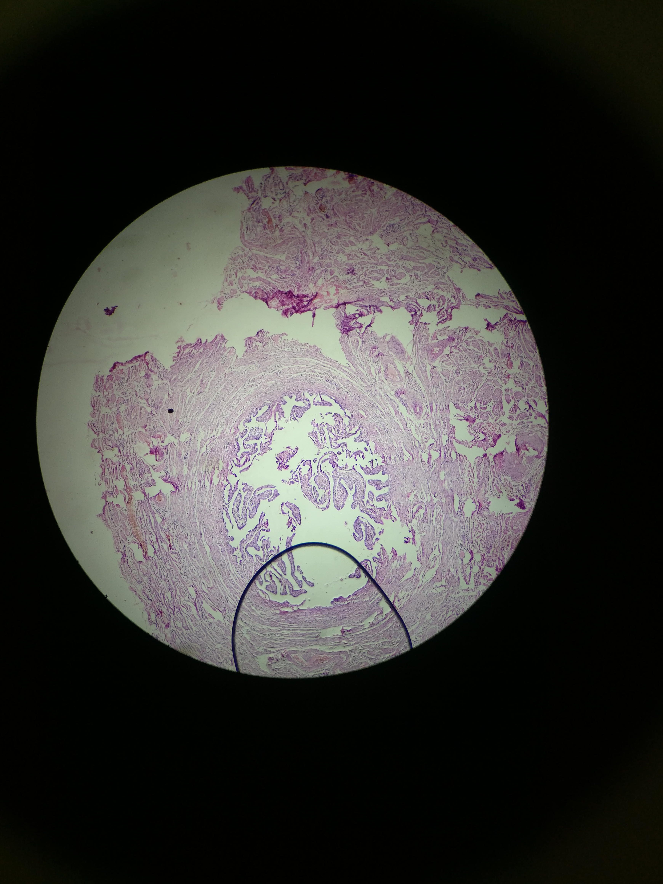
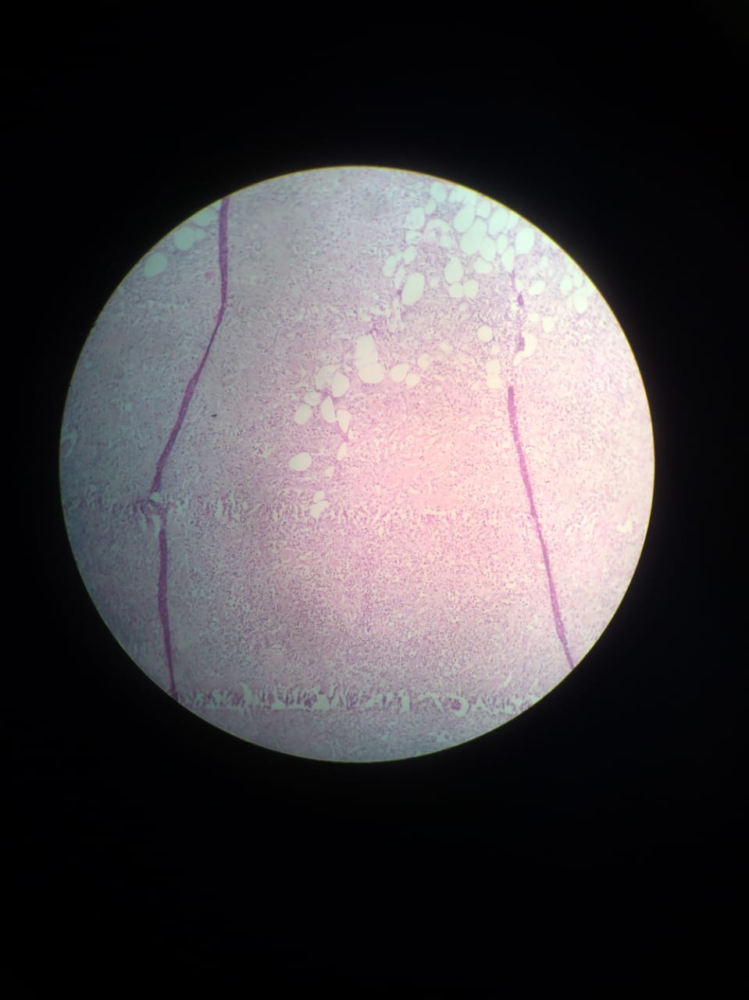
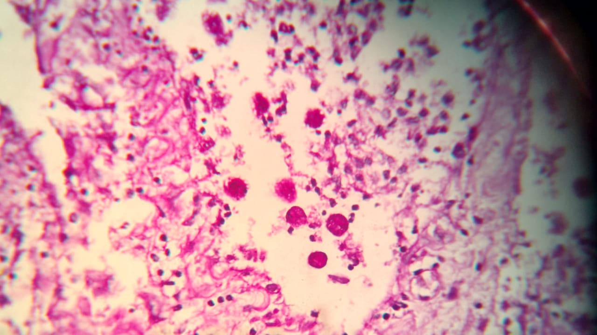

# Project, M.D.
A speedy Android app system that efficiently delivers diagnostic information written by pathologists to their fellow doctors.
## Table of Contents
- [Introduction](#Introduction)
  - Problem
  - Aim
  - Challenges
  - Approach
- [Technologies Used](#Technologies-Used)
- [Features](#Features)
- [Demo and Presentation](#Demo-and-Presentation)
- [Future Scope](#Future-Scope)
- [Societal Implementation](#Societal-Implementation)

## Introduction
### Problem
Pathology is a field that has seen significant advancements in technology, from better techniques to non-invasively collect tissue samples and blood samples to revolutionizing ways to detect diseases with artificial intelligence. But all these **new technologies** come at **enormous costs**, which most hospitals in the world are unable to adopt, much less a developing country like India with a **sparse patient-to-doctor ratio**. Almost 122 Indians per 100,000 die due to the low quality of healthcare each year. 

[Back to Top](#table-of-contents)

### Aim
**Medical information is sensitive and private**. Typical diagnosis involves the transfer of medical documents from one department to another (microbiology to histopathology, for example), resulting in misplacement of sensitive data.

What our **doctors in government hospitals need** is a speedy system that is **convenient, sensible, simple, and secure**; so that they can deliver the results and diagnosis to the patients at the right time with the required accuracy. One of the main **driving forces** of **digital pathology** is the **speed of delivery**. 

We have attempted to build an **Android App** to digitize the process of a pathologist’s diagnosis of diseases so that the sensitive data is conveniently shareable. 
It also makes microscopy easier and reduces the occupational hazard to the pathologists’ necks associated with long hours of peering through the microscope.

[Back to Top](#table-of-contents)

### Challenges
-   It is difficult for pathologists to adjust and refocus their microscopes every time they have to make an observation of the slide. It would be easier for them to operate a image of the slide that they only need to take once and can use it to zoom-in zoom-out and embed it in the respective pdf form.
    
-   When pathologists see microscope slides, they note their observations and diagnostic hypothesis in special forms that are specific to that tissue-sample or requested lab test (Example, FNAC, Endocrine Test Request form, etc.)
    
-   Using paper to store and document this medical information is unreliable since paper can experience wear and tear and it would be very easy to tamper the data or lose the file altogether due to an organizing error or mismanagement.
    
-   To share this information conveniently and securely, it is necessary to digitize the process of disease diagnosis and sharing of important forms and reports amongs doctors.
    
-   Worked with pathologists to convert their tissue-sample specific forms into fillable PDFs and added the functionality of e-Signatures, slide image embedding, approval stamps, encryption, etc.

[Back to Top](#table-of-contents)

### Approach
A 3D-printed Universal smartphone holder was custom-designed to align and firmly position any smartphone’s camera with a regular microscope’s eyepiece lens to take pictures of the slides under observation. **Maneuvering the slide images** and **transfer of data** became easy through **custom fillable PDFs** which were **designed in close collaboration** with my mother and her colleagues(Pathologists at VS Hospital), a government hospital in Ahmedabad, India.

[Back to Top](#table-of-contents)

## Technologies Used
1. Google's Firebase for Authentication  
Using Firebase Authentication makes building secure authentication system easier and also improved the sign-in and on-boarding experience for the less tech savvy users. 
We have used Google authentication which enables user to login with their google account.

2. Glide API for Images  
Glide is an open source image loading and caching library for Android apps. Using this, we were able to load high-resolution images of different slides in our app.

3. Android SQLite for Local Data storage  
We have used this to store patient’s data on the phone locally. The main reason behind using SQLite and not using Firebase is that medical data needs to be secure. 
By making it local the data is restricted only to the device in which it is stored.

4. 3D Printing  
Specially designed 3D-Printed Universal Smartphone Adapter for using all smartphones with a microscope

[Back to Top](#table-of-contents)

## Features

- Lab Test or **Investigation-specific fillable PDF forms** that have been created in collaboration with actual pathologists (who are the target audience for this app)
- Designed to be intuitive and pre-cognitive, using Google’s Material Design Guidelines, keeping in mind the less tech-savvy nature of its target audience
- All the images and filled forms that contain sensitive medical data are stored locally in the phone’s memory using SQLite Database for best security 
- The PDF form can be edited to have **e-Signatures, approval stamps, annotations, full-resolution image embedding, and a whole suite of more features** that we added to the app using the PDFTron SDK as a PDF Viewer base.
- All the images and filled forms can be sent to a peer doctor in the form of a locked and password-protected PDF using apps like Gmail and WhatsApp.

[Back to Top](#table-of-contents)

## Demo and Presentation

Link to Presentation for IETE Software Competition, 2019 (First Prize from amongst 130+ teams, got 2 internship offers one from Reliance): https://docs.google.com/presentation/d/1AoORRi6xBqqANJxLTnVOVHSb1fngFirPw1g3Bg9bS6k/edit?usp=sharing

[Back to Top](#table-of-contents)

## Future Scope

After **consulting pathologists and testing** the app on real microscopes in a government hospital for the second time, we **received positive responses**, giving us a deep insight into our user needs.   
Link to Interview with Pathologists and Resident Doctors at NHL Medical College: https://photos.app.goo.gl/BPbzPJ1BftEzhNgF7

We have even approached our Computer and Network Prof. Ratnesh Chaturvedi for a joint research paper for adding extra security to our app for more secure data transfer.

One of the doctors suggested adding the doctor’s authentication number and their essential identification, ensuring security while sharing sensitive medical data.

We plan to take up a machine learning course Google’s TensorFlow, to analyze those images with convolutional neural networks and deep neural networks to detect biomarkers in the tissue slides for disease detection.  
After three months of testing and redesign, we were able to build a user friendly system for the pathologists at VS Hospital. The Android app made their day-to-day tasks of tracking diagnostic forms, taking microscopic images, transferring sensitive medical information to their peers for a second-opinion a lot faster with their smartphones’ convenience. 

[Back to Top](#table-of-contents)

## Societal Implementation
Our project primarily caters to the needs of Pathologists in government hospitals and Medical Resident students. It provides an effective and efficient way to deal with Medical information such as images and PDFs of the specimen slides under the microscope that involves hypothesis, diagnosis and conclusion as observed by the pathologists.  

Throughout the development processes the design has revolved around boosting the speed-of-delivery of each patient’s data from one pathologist to another in conveniently shareable formats.

[Back to Top](#table-of-contents)
